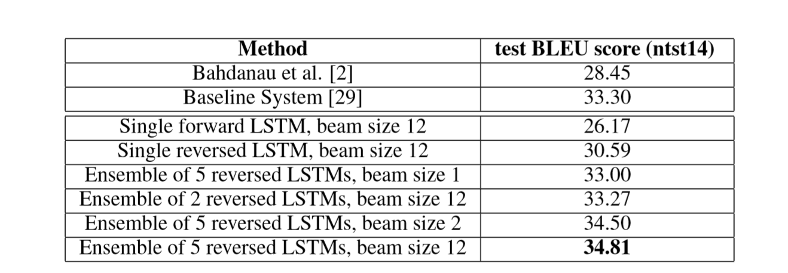

# Report

## Sequence to Sequence Learning with Neural Networks

[https://papers.nips.cc/paper/5346-sequence-to-sequence-learning-with-neural-networks.pdf](https://papers.nips.cc/paper/5346-sequence-to-sequence-learning-with-neural-networks.pdf)

### Introduction

* **Background-info:** Given a large labeled training sets,Deep Neural NetWorks\(DNNs\) can not be used to map sequences to sequences\(STS\).
  * _The limitation of DNNs_: It can **only** be applied to problems whose inputs and targets can be sensibly encoded with vectors of fixed dimension.
* **Objective**: A general end-to-end approach to sequence learning that makes minimal assumptions on the sequence structure.
* **Method**: Long Short-Term Memory\(LSTM\) can solve general the STS problems.The advantages of LSTM is that it learns to map an input sentence of variable length into a fixed-dimensional vector representation.

### Model Structure

* **Two different LSTMs**: One for the input sequence and another for the output sequence and the end of the input of the LSTM extracts the variable length sentences and the other is a simple kind of decoder. 
* **Deep LSTMs**: It find out that deep LSTMs significantly outperformed shallow LSTMs.
* **Heuristic idea**: Reverse the order of the words of the input sentence: for instance $$a$$,$$b$$,$$c$$ c is corresponding to  $$\alpha, \beta, \gamma$$,the LSTM is asked to map $$c,b,a $$ to $$\alpha, \beta, \gamma$$ where $$\alpha, \beta, \gamma$$ is the translation of $$a,b,c $$ 

### Relative Work

* Auli et al. combine NNML with the topic model of the input sentence
* Devlin et al. merge NNLM into the decoder of the MT system 
* Kalchbrenner and Blunsom, using convolutional neural networks to map sentences to vectors
* Cho et al. use a NNTM-like RNN architecture to map sentences to vectors
* Bahdanau et al. attempted to use a neural network for direct translation
* Pouget-Abadie et al. tried to solve the memory problem of Cho et al
* Hermann et al. focus on end-to-end training

### Experiments result

The author applied this method to the WMT\`14 English to French MT task in two ways.The one is to directly translate the input sentence without using a reference SMT system.The other is to rescore the n-best lists of an SMT baseline.

### Personal evaluation

* **A simple straightforward and a relatively unoptimized system can outperform a mature SMT system**: Consider RNN can not only easily map sequences to sequences whenever the alignment between the inputs the outputs is known ahead of time but also can deal with mapping the input sequence to a fixed-sized vector.But to solve the problem whose input and output have different lengths with complicated and non-monotonic relationships. RNN do have it limitations.So the author put a method  by using two different LSTMs with deep enough depth to process the STS problem.Significantly reversing the words of the source can let the LSTM capture more short term dependencies which obviously increase the BLEU score.
* **Inadequacies**: 
  * Unable to train a std RNN on the non-reversed translation problem.
  * A std RNN should be easily trainable when the source sentences are reversed_**\(can not be proved\)**_

### Innovation

* **Two different LSTMs:**
  * **One for mapping sequence to fixed-dimensional vector**
  * **One for decoding the fixed-dimensional vector to the output sentences.** 
* **Reverse the source sentences:**
  * **short term dependencies.**

